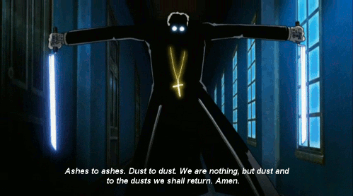
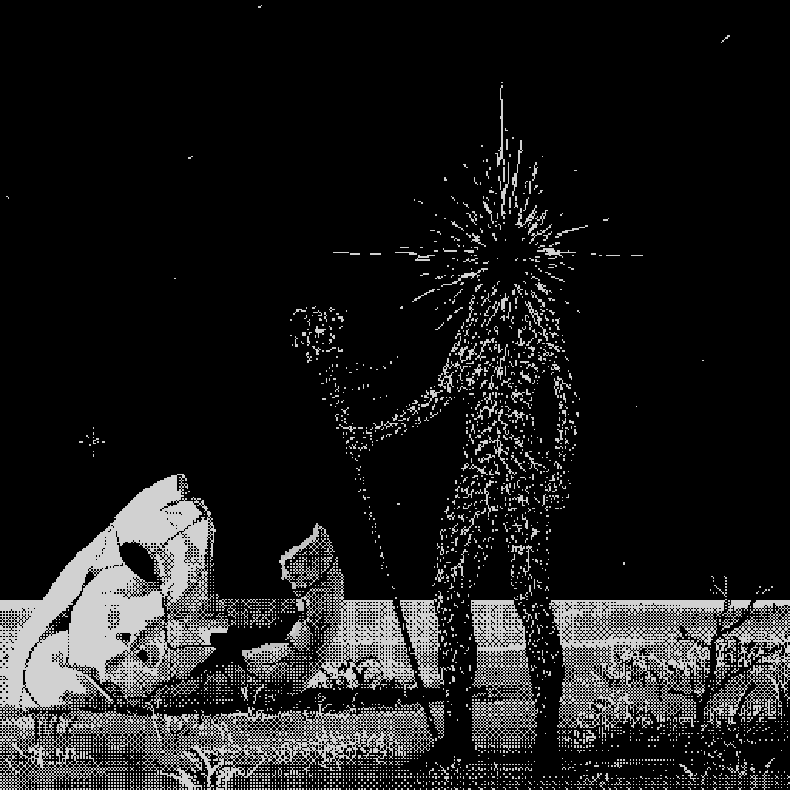
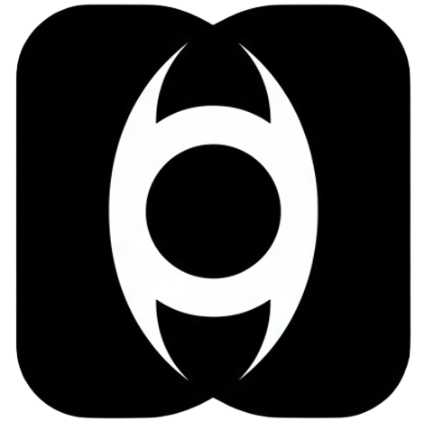
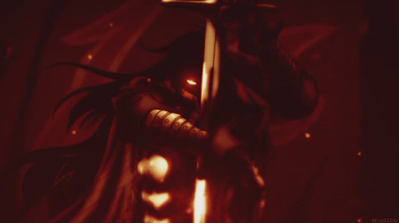

<!-- TOP GIF -->

 
 

<!-- ==================== HEADER SECTION ==================== -->
<h3>✠ ════════════════════════════════════════════════════════════ ✠</h3>

<table width="90%" border="0" cellspacing="0" cellpadding="0">
<tr>
<td width="15%" align="center" valign="middle">

</td>
<td width="70%" align="center" valign="middle">

 

</td>
<td width="15%" align="center" valign="middle">

</td>
</tr>
</table>

<h3>✠ ════════════════════════════════════════════════════════════ ✠</h3>

 
 

<!-- PROJECTS "ICONS" -->
<table width="100%" border="0" cellspacing="0" cellpadding="0">
<tr>
<!-- PROJECT 1: MultiSocials -->
<td width="33%" align="center" valign="top">

 

</td>

<!-- PROJECT 2: GitHub-Quick-Account-Switcher -->
<td width="33%" align="center" valign="top">

 

</td>

<!-- PROJECT 3: Kriss -->
<td width="33%" align="center" valign="top">

 

</td>
</tr>
</table>

 

<h3>✠ ════════════════════════════════════════════════════════════ ✠</h3>

 

<!-- BIBLE VERSES SECTION -->
<table width="100%" border="0" cellspacing="0" cellpadding="0">
<tr>
<!-- COLUMN 1: Psalm 119 -->
<td width="33%" align="center" valign="top">

 
 
<i>"Oh how I love Your law! It is my meditation all the day. Your commandments make me wiser than my enemies, For they are mine forever. I have more insight than all my teachers, For Your testimonies are my meditation. I perceive more than the aged, Because I have observed Your precepts. I have restrained my feet from every evil way, That I may keep Your word. I have not turned aside from Your judgments, For You Yourself have taught me. How sweet is Your word to my taste! Sweeter than honey to my mouth! From Your precepts I get perception; Therefore I hate every false way."</i>
</td>

<!-- COLUMN 2: Stacked Verses -->
<td width="33%" align="center" valign="top">
<!-- Psalm 37:13 -->

 
 
<i>"But the Lord laughs at the wicked, for He knows that their day is coming."</i>
 
 
<!-- 1 Corinthians 1:31 -->

 
 
<i>so that, just as it is written, “LET HIM WHO BOASTS, BOAST IN THE LORD.”</i>
 
 
<!-- Proverbs 16:4 -->

 
 
<i>"YHWH has made everything for its own purpose, Even the wicked for the day of evil."</i>
</td>

<!-- COLUMN 3: Empty -->
<td width="33%" align="center" valign="top">
</td>
</tr>
</table>

 

<h3>✠ ════════════════════════════════════════════════════════════ ✠</h3>

 

<!-- BOTTOM GIF (Vlad) -->

